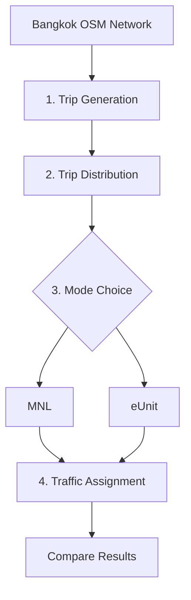

# Bangkok Four-Step Model: MNL vs eUnit Mode Choice

A four-step travel demand model built on a **real Bangkok road network**
from OpenStreetMap, comparing two mode choice models:

- **MNL** (Multinomial Logit): the standard baseline
- **eUnit**: a bounded rationality choice model

**Goal:** test which model better recovers known travel behaviour,
using synthetic demand on a real network.

> 🚧 Status: work in progress 

## Model Pipeline

## Repository Structure

| Folder / File | Purpose |
|---|---|
| `src/network.py` | Build road network from OSM |
| `src/generation.py` | Trip generation |
| `src/distribution.py` | Trip distribution |
| `src/mode_choice/` | MNL and eUnit models |
| `src/assignment.py` | Traffic assignment |
| `data/` | Input data |
| `results/` | Outputs and figures |